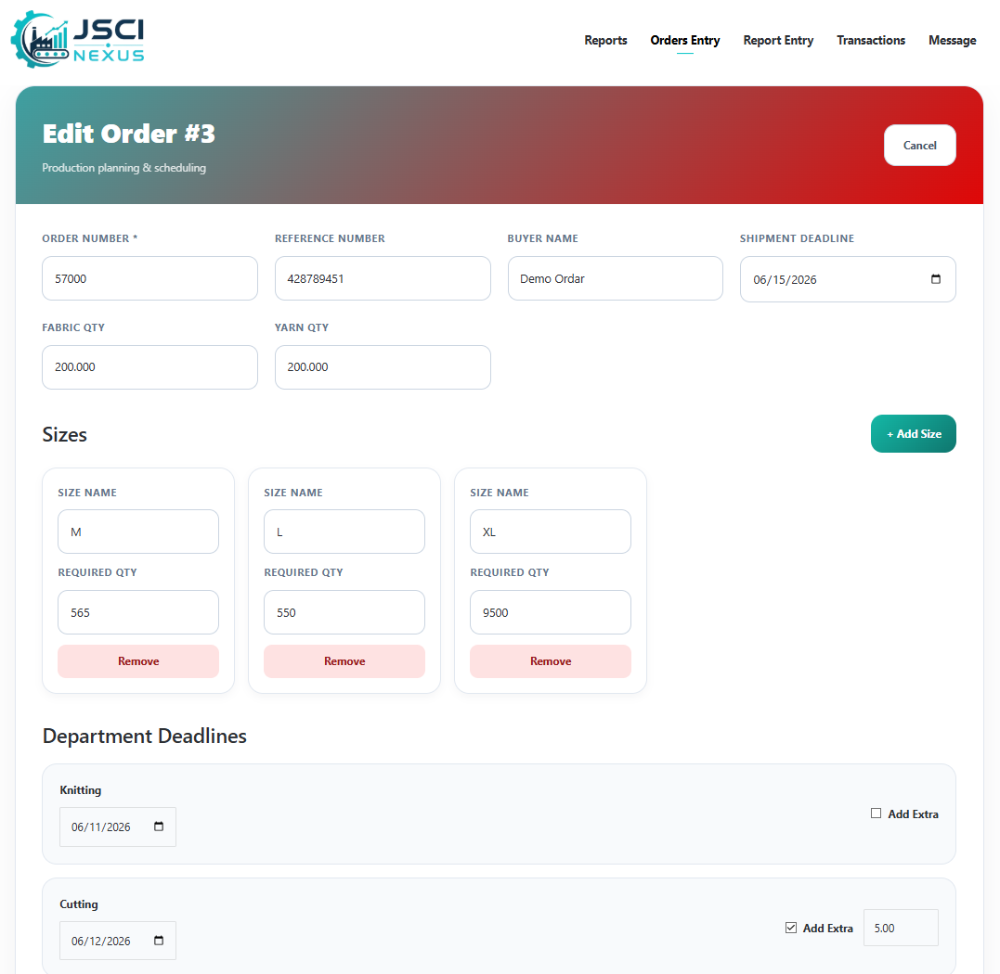
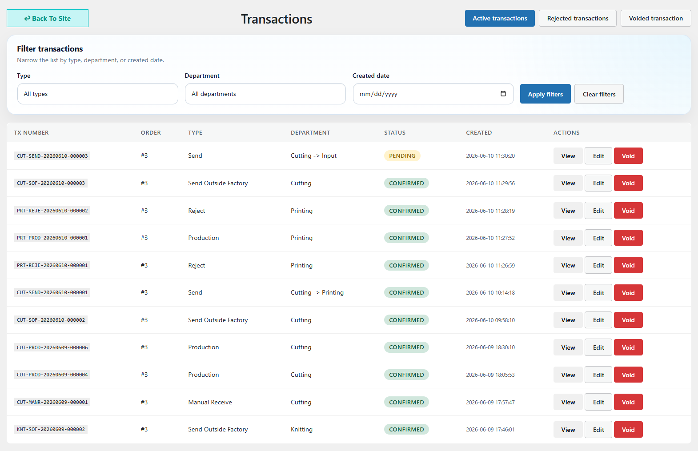

# JSCI NEXUS

**JSCI NEXUS** is a custom-built production workflow management system designed for garment manufacturing operations.

Built using **WordPress, PHP, MySQL, and Vanilla JavaScript**, the system helps production teams manage orders, track department-wise production movement, monitor shipment readiness, control user access, and generate operational reports from a centralized dashboard.

A real-world production management solution developed to provide complete visibility, accountability, and control throughout the manufacturing process.

---

## Features

- Order Management – Manage buyers, references, quantities, deadlines, and production requirements.
- Size-Wise Production Tracking – Monitor production quantities by  size throughout the workflow.
- Department Workflow Management – Configure departments, workflow sequences, production lines, and transaction rules.
- Production Transactions – Handle receive, produce, send, reject, return, and outside-factory transactions.
- Multiple Entry Modes – Support for Size, KG, and Cutting-based production entries.
- Shipment Readiness Tracking – Monitor order completion and shipment preparation status.
- Reporting & KPIs – Generate production reports, analytics, and performance metrics.
- Audit Logs – Maintain a complete history of user actions and production activities.
- Role-Based Access Control – Manage permissions for employees, supervisors, administrators, and management.
- Internal Messaging – Communication tools for production teams.
- REST API Integration – Custom API endpoints for integrations and future expansion.

---

## Tech Stack

- **Backend:** PHP 8+, WordPress Plugin Architecture
- **Database:** MySQL / MariaDB
- **Frontend:** Vanilla JavaScript, HTML, CSS
- **API:** WordPress REST API
- **Platform:** WordPress

---

## Installation

1. Clone the repository:

   ```bash
   git clone https://github.com/thisisohan/jsci-nexus.git
   ```

2. Upload the plugin folder to:

   ```text
   wp-content/plugins/
   ```

3. Upload the templates files to:

   ```text
   wp-content/themes/child-themes
   ```

4. Log in to the WordPress Admin Dashboard.

5. Activate **JSCI NEXUS**.

6. The system will automatically create:
   - Database tables
   - User roles and permissions
   - Required settings
   - REST API endpoints

---

## Core Modules

### Dashboard

Production overview, KPIs, active orders, shipment readiness, and recent activities.

### Orders

Manage production orders, buyer information, size breakdowns, quantities, and deadlines.

### Transactions

Track production movement between departments with complete transaction history.

### Departments

Configure workflow sequences, production lines, transaction rules, and operational settings.

### Reports

Generate production reports, KPI summaries, order status reports, and shipment analytics.

### Access Management

Control user permissions, department access, line access, and operational capabilities.

### Audit Logs

Maintain complete traceability of production and administrative activities.

### Messaging

Internal communication tools for production teams and management.

---

## Screenshots

### Dashboard


### Orders Management



### Cutting Entry


### Production Entry


### Imcoming Transactions


### Departmant Management


### Transactions



### Reports

## Confidential. Demo Image will upload soon.

### Access Management
User Roles

- JSCI Employee
- JSCI Admin
- JSCI Super Admin

Modify power management and user capabolitys with Access Management


### Transection Details


---

## REST API

Base Endpoint:

```text
/wp-json/jsci-prm/v1
```

Available Resources:

```text
/orders
/transactions
/departments
/reports
/access-management
/messages
/external-organizations
```

---

## Author

**Md. Sohanur Rahaman Khan**

Full-stack developer specializing in business applications, workflow automation, dashboards, and enterprise management systems.

- GitHub: https://github.com/thisisohan
- LinkedIn: https://linkedin.com/in/yourprofile  
- Email: sohankhan.contact@gmail.com

---

## License

GPL-2.0-or-later
